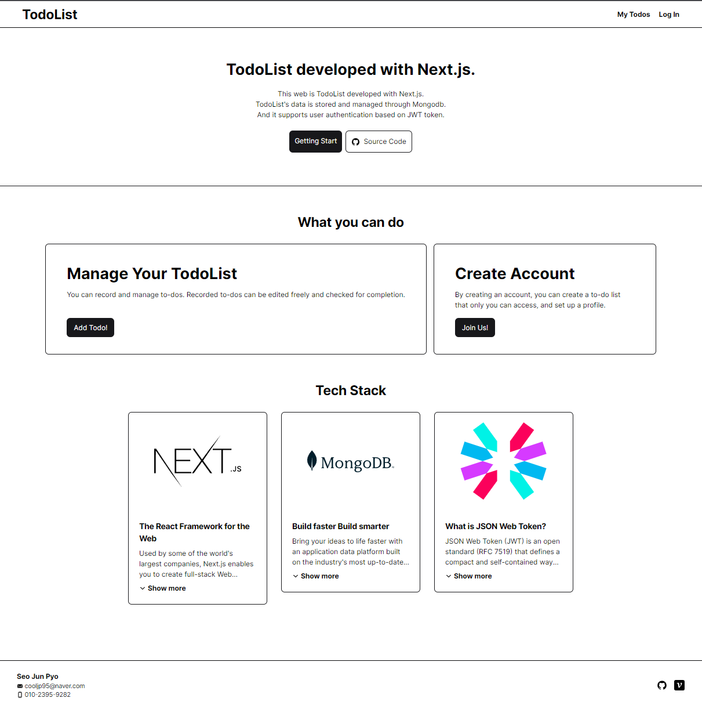

# TodoList

## Introduce

Next.js 연습용 미니 프로젝트입니다. 

TodoList 기능 구현을 통해 CRUD을 구현하는 방법을 익히고, JWT 토큰 기반으로 유저 인증을 구현합니다.
TodoList와 유저 정보를 저장하고 관리하기 위해 MongDB를 사용했습니다.

---

## Tech Stack
`Next.js` `TypeScript` `MongoDB` `Tailwind`

---

## 만들기 힘들었던거 정리해둔 글들

- 모달 구현

https://velog.io/@cooljp95/Next.js-%EB%9D%BC%EC%9A%B0%ED%8C%85%EC%9C%BC%EB%A1%9C-%EB%AA%A8%EB%8B%AC-%EA%B5%AC%ED%98%84%ED%95%98%EA%B8%B0

---

> TodoList가 이상하게  커지고 있다...